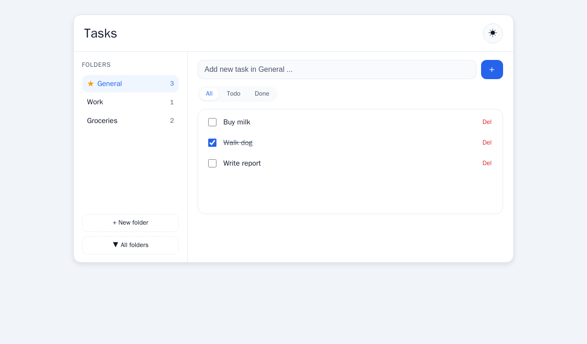
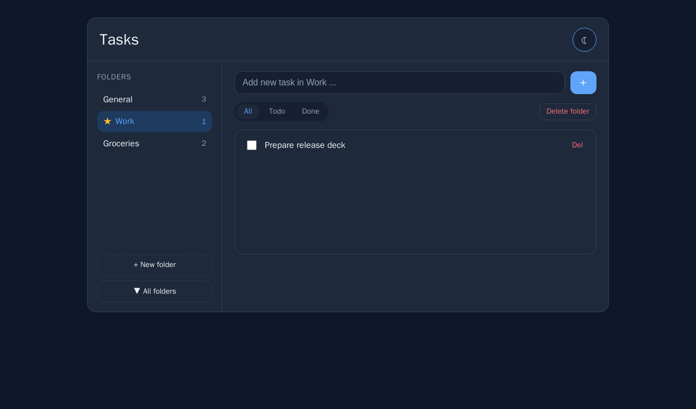

# Taskmaple — folder-based TODO SPA

A sample BusinessRepo built end-to-end to show what [MAPLE](https://github.com/kinncj/maple) can do
when driven by **Claude Code** on **Claude Opus 4.8**.

The entire project was produced by Claude running **autonomously** — including this README file. The
only standing instruction was to **auto-approve the MAPLE/taffy pipeline gates** instead of pausing
for human sign-off at each stage. From there, Claude leaned on the MAPLE steps to do all of it:

- **User story** in Gherkin, with acceptance scenarios
- **Wireframes** in three formats and a design-token system
- **Architecture** — ADR, OpenAPI contract, STRIDE threat model
- **Code** — Spring Boot backend and React frontend
- **Tests** — unit, integration, and end-to-end
- **Documentation** — feature overview, API reference, diagrams
- **Containers** — a multi-stage Docker build and compose
- **GitHub** — issues, a pull request, and a merge to `main`

And it kept going until the result was **tested, buildable, and shippable**. The app runs.

## What it is

A small but complete TODO single-page app where tasks live in folders.

- Tasks belong to exactly one folder. Selecting a folder scopes the list and the add-task input.
- Deleting a folder reassigns its tasks to the default `General` folder in one transaction.
  `General` can't be deleted, so tasks are never orphaned.
- Live per-folder counts, an `All / Todo / Done` filter that survives folder switches, an
  `All folders` aggregate view, and a persisted light/dark theme.

| Light | Dark |
|-------|------|
|  |  |

## Stack

- **Backend** — Java 21, Spring Boot 3.3, H2 in-memory. Clean Architecture: a framework-free domain
  and application core behind ports, JPA adapters in infrastructure. Versioned REST API, Swagger UI,
  actuator health, structured audit logs.
- **Frontend** — Vite + React + TypeScript. A single `useReducer` store, design-token-driven CSS,
  WCAG 2.2 AA in both themes.
- **Packaging** — one multi-stage Docker image (vite build → maven build → JRE) serves the SPA and
  the API from the same origin.

## Run it

```bash
make run        # build + run at http://localhost:8080
make test-all   # unit + integration + e2e + contract
```

Docker is the only hard dependency; Maven and the Playwright browsers run in containers, so you
don't need them installed locally.

- App: <http://localhost:8080>
- Swagger UI: <http://localhost:8080/swagger-ui.html>
- OpenAPI: <http://localhost:8080/v3/api-docs>
- Health: <http://localhost:8080/actuator/health>

## How it was built

Claude ran the MAPLE `new-ui-feature` taffy pipeline, gate by gate:

```
spec-kit → wireframe → visual-identity → design-tokens → ui-mockup
        → ARCHITECT → INFRA → IMPLEMENT → Karpathy gate → VALIDATE → DOCUMENT → a11y-audit
```

Highlights from the run:

- A Gherkin story drove everything; its 13 scenarios became the acceptance suite.
- Wireframes in three formats (`.md`, `.html`, `.excalidraw`) and a token system (W3C DTCG) feeding
  CSS, Tailwind, and Mantine outputs.
- An ADR, an OpenAPI contract, and a STRIDE threat model before code.
- A self-review pass: the Karpathy gate scored 94/100; an independent "rubber-duck" reviewer found
  five issues (optimistic-toggle revert, a single-default DB guard, a delete-reassign race, request
  ordering, query encoding), all fixed and re-reviewed to approval.

## Tests

| Layer | Count |
|-------|-------|
| Backend unit (domain + application) | 30 |
| API integration (H2) | 17 |
| Frontend unit | 31 |
| End-to-end (Playwright; every Gherkin scenario) | 13 |
| Accessibility (axe, light + dark) | 0 violations |

`make test-all` is green.

## Layout

```
app/api     Spring Boot service (domain · application · infrastructure · web)
app/web     Vite + React SPA
tests/      Gherkin features + Playwright e2e
infra/      Dockerfile + compose
docs/       story, design system, ADR, contract, threat model, feature docs
Makefile    every CI/CD action is a make target
```

This follows the MAPLE **BusinessRepo** model: one repo owns everything needed to build, test, run,
and document a single capability.

## Pointers

- Story: [`docs/stories/folders-001-folder-organization.md`](docs/stories/folders-001-folder-organization.md)
- Feature overview: [`docs/features/folders-001-overview.md`](docs/features/folders-001-overview.md)
- API reference: [`docs/features/folders-001-api.md`](docs/features/folders-001-api.md)
- ADR-0001: [`docs/specs/adrs/0001-folder-task-domain-and-reassignment.md`](docs/specs/adrs/0001-folder-task-domain-and-reassignment.md)
- Architecture diagrams: [`docs/architecture/folders-001-architecture.md`](docs/architecture/folders-001-architecture.md)

---

Built with [MAPLE](https://github.com/kinncj/maple) and Claude Code (Claude Opus 4.8), running
autonomously with auto-approved pipeline gates.
