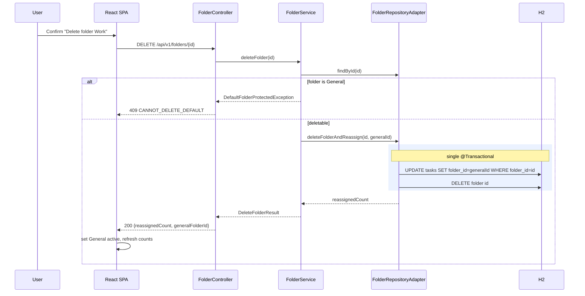
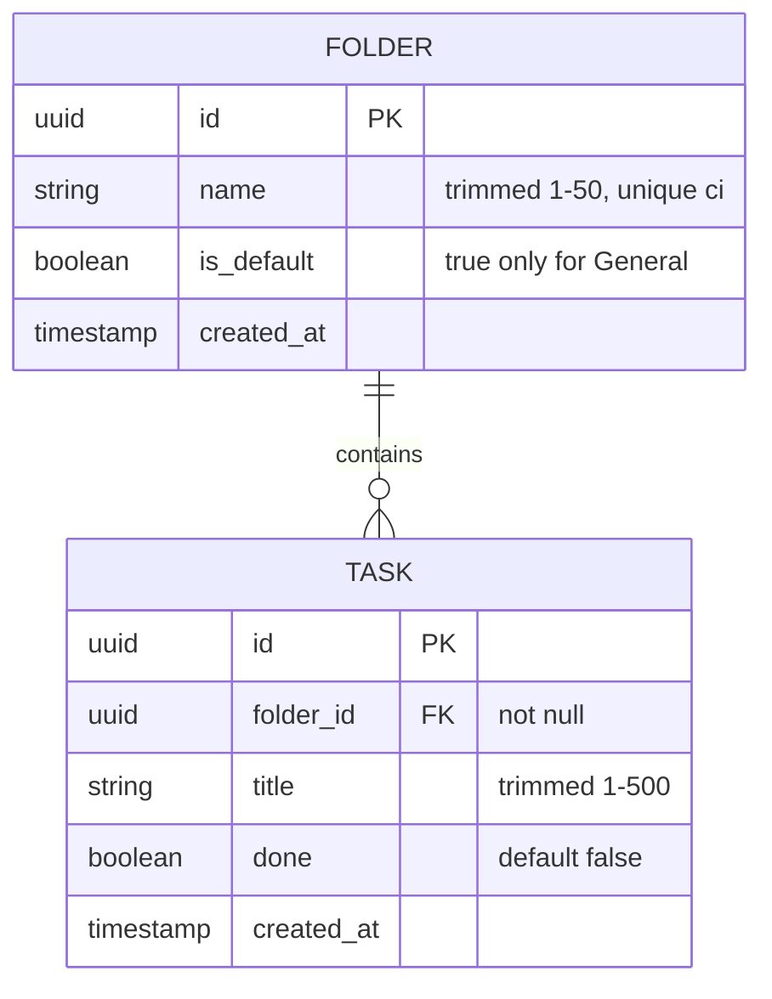
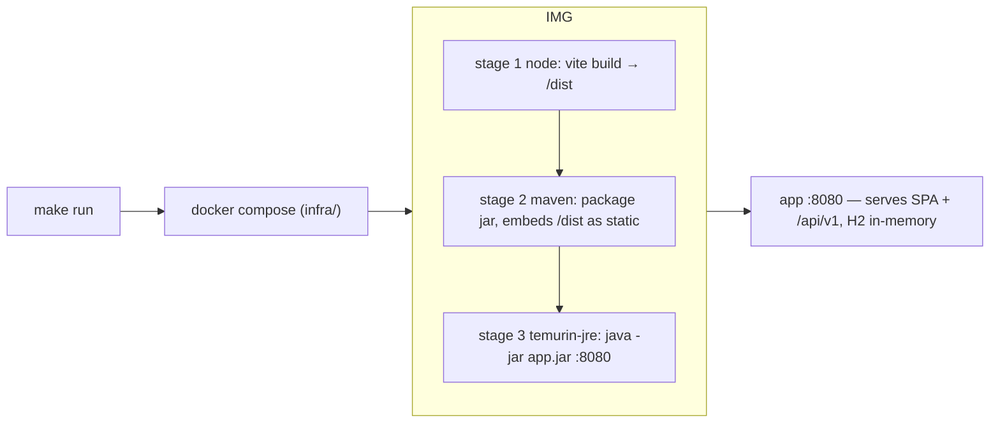

# folders-001 — Architecture

Story: `folders-001`. Stack: Java 21 + Spring Boot 3.3 (H2 in-memory) · Vite + React + TypeScript.
Layering: hexagonal (domain ← application ← {web, infrastructure}). See ADR-0001.

## Component view

```mermaid
flowchart TD
  subgraph Web["app/web — React SPA"]
    UI["Components: Sidebar, TaskList, AddTask, FilterPills, DeleteConfirm, ThemeToggle"]
    Store["State store (useReducer) + api client"]
    UI --> Store
  end
  subgraph Api["app/api — Spring Boot"]
    subgraph WL["web layer"]
      FC["FolderController"]
      TC["TaskController"]
      EH["ApiExceptionHandler"]
    end
    subgraph AL["application layer (framework-free)"]
      FS["FolderService"]
      TS["TaskService"]
    end
    subgraph DL["domain layer (pure)"]
      FM["Folder, Task"]
      PORTS["FolderRepository, TaskRepository (ports)"]
    end
    subgraph IL["infrastructure layer"]
      FA["FolderRepositoryAdapter @Transactional"]
      TA["TaskRepositoryAdapter"]
      H2[("H2 in-memory")]
    end
    BOOT["DataInitializer — creates General"]
  end
  Store -->|"/api/v1"| FC
  Store -->|"/api/v1"| TC
  FC --> FS --> PORTS
  TC --> TS --> PORTS
  FS -. uses .-> FM
  PORTS <-.implemented by.- FA
  PORTS <-.implemented by.- TA
  FA --> H2
  TA --> H2
  BOOT --> FA
```

## Sequence — delete folder with transactional reassignment (FR-6)



## Data model (ER)



## Deployment



The SPA is served as static resources by Spring Boot, so the browser, API, and store share one
origin (`:8080`) — no CORS, no proxy. `make test-e2e` drives this running container with Playwright.
